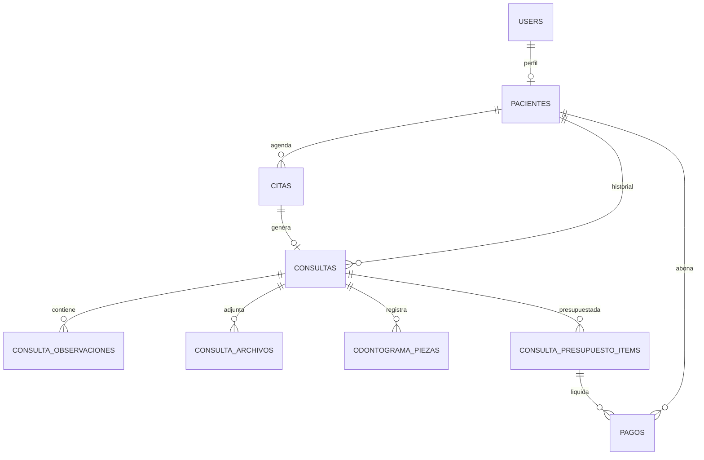

# Manual técnico - Clínica Dental

## 1. Arquitectura

El sistema está construido con Laravel 12, MySQL, Vite y Tailwind CSS. La aplicación separa responsabilidades en cuatro capas principales:

- Rutas: `routes/web.php`, donde se agrupan rutas públicas, rutas autenticadas, rutas por rol y rutas del portal del paciente.
- Controllers: `app/Http/Controllers`, responsables de recibir requests, autorizar acciones y devolver respuestas.
- Services: `app/Services`, donde vive la lógica de negocio reutilizable.
- Models: `app/Models`, con relaciones Eloquent, casts y reglas de dominio cercanas a los datos.

La regla de mantenimiento para controllers es: validar/autorizar, llamar al service y responder. La lógica de negocio de citas y consultas debe permanecer centralizada en `CitaService` y `ConsultaService`.

## 2. Capa de servicios

### `CitaService`

Centraliza:

- Creación de citas desde backoffice.
- Creación de citas públicas con creación/reutilización de usuario paciente.
- Confirmación, cancelación y reagendado por paciente.
- Cancelación administrativa.
- Transición a `atendida` cuando se crea consulta.
- Cierre automático de citas vencidas como `no_show`.
- Sincronización de recordatorios de seguimiento.

Depende de `AppointmentAvailabilityService` para validar disponibilidad y de los mailables/notificaciones existentes para confirmaciones y recordatorios.

### `ConsultaService`

Centraliza:

- Listado paginado de historial clínico con eager loading.
- Alta de consulta vinculada a paciente y opcionalmente a cita.
- Marcado automático de cita como `atendida`.
- Envío de correo cuando se cierra una consulta.
- Registro de consultas de seguimiento.
- Observaciones y archivos asociados a consultas.
- Carga de datos necesarios para las vistas de consulta.

## 3. Modelo de datos resumido



Entidades principales:

- `User`: cuenta autenticada con rol `admin`, `doctor` o `paciente`.
- `Paciente`: ficha clínica y datos personales del paciente.
- `Cita`: agenda, estado y recordatorios.
- `Consulta`: historial clínico, diagnóstico, tratamiento y cierre.
- `ConsultaPresupuestoItem`: líneas de presupuesto por consulta.
- `Pago`: pagos parciales o totales asociados al paciente y presupuesto.

## 4. Roles y autorización

El middleware `role:` se usa para gating general de rutas. Las reglas de acceso a recursos específicos se centralizan en policies:

- `PacientePolicy`: controla lectura y administración de pacientes. Un paciente solo puede ver su propia ficha.
- `ConsultaPolicy`: controla historial clínico, odontograma, archivos y observaciones. Un paciente solo puede ver sus propias consultas.
- `PagoPolicy`: controla creación de pagos para pacientes.
- `PresupuestoItemPolicy`: controla creación, edición, aceptación y eliminación de ítems de presupuesto.

Las policies están registradas en `app/Providers/AppServiceProvider.php` mediante `Gate::policy(...)`. En controllers se usa `$this->authorize(...)`.

## 5. Rendimiento

Listados principales revisados:

- `pacientes.index`
- `consultas.index`

Buenas prácticas aplicadas:

- Usar `with(...)` para relaciones necesarias en listados.
- Usar `withCount(...)` cuando solo se necesita contar registros relacionados.
- Evitar cargar colecciones completas si la vista solo muestra totales.
- Agregar índices por migración para columnas usadas en búsqueda, ordenamiento o filtrado frecuente.

Índices agregados:

- `pacientes(nombre_completo)`
- `consultas(paciente_id, fecha, created_at)`

## 6. Seguridad y dependencias

Comando de revisión:

```powershell
composer audit
```

Estado del Sprint 10: `composer audit` reporta 0 advisories.

Se actualizó `composer.lock` para subir Laravel y dependencias relacionadas a versiones sin advisories conocidos. En ambiente local puede ser necesario usar `--ignore-platform-req=ext-gd` al actualizar dependencias si PHP local no tiene habilitada la extensión `gd`; dentro de Docker debe instalarse según la imagen del proyecto.

## 7. Correos y recordatorios

Variables importantes de `.env` / `.env.docker`:

```env
MAIL_MAILER=smtp
MAIL_HOST=smtp.gmail.com
MAIL_PORT=587
MAIL_USERNAME=correo@clinica.com
MAIL_PASSWORD=app_password_de_gmail
MAIL_ENCRYPTION=tls
MAIL_FROM_ADDRESS=correo@clinica.com
MAIL_FROM_NAME="Clínica Dental"
```

Para pruebas locales puede usarse:

```env
MAIL_MAILER=log
```

Con `MAIL_MAILER=log`, los correos se escriben en `storage/logs/laravel.log` y no salen a Gmail.

Comando manual de recordatorios:

```powershell
docker compose --env-file .env.docker exec app php artisan reminders:send --hours=24
```

En producción debe configurarse el scheduler de Laravel para ejecutar `php artisan schedule:run` cada minuto.

## 8. Runbook de despliegue

Pasos recomendados:

1. Configurar `.env` de producción con base de datos, `APP_URL`, `APP_KEY`, mail SMTP y variables seguras.
2. Instalar dependencias:

```powershell
composer install --no-dev --optimize-autoloader
npm ci
npm run build
```

3. Ejecutar migraciones:

```powershell
php artisan migrate --force
```

4. Optimizar Laravel:

```powershell
php artisan config:cache
php artisan route:cache
php artisan view:cache
```

5. Configurar scheduler:

```cron
* * * * * cd /ruta/al/proyecto && php artisan schedule:run >> /dev/null 2>&1
```

6. Verificar salud:

```powershell
php artisan test
composer audit
```

7. Probar flujo crítico:

- Crear cita pública.
- Confirmar que llega correo de confirmación.
- Ejecutar `reminders:send --hours=24`.
- Validar que no reenvía recordatorios ya marcados con `recordatorio_enviado_at`.
- Crear consulta vinculada a cita y confirmar transición a `atendida`.

## 9. Rutas funcionales clave

- `/dashboard`: panel operativo del día.
- `/analisis`: panel analítico con métricas, gráficas y exportación.
- `/pacientes`: gestión de pacientes.
- `/citas`: gestión de citas.
- `/calendario`: vista calendario.
- `/portal`: portal del paciente autenticado.
- `/agendar-cita`: formulario público de citas.
